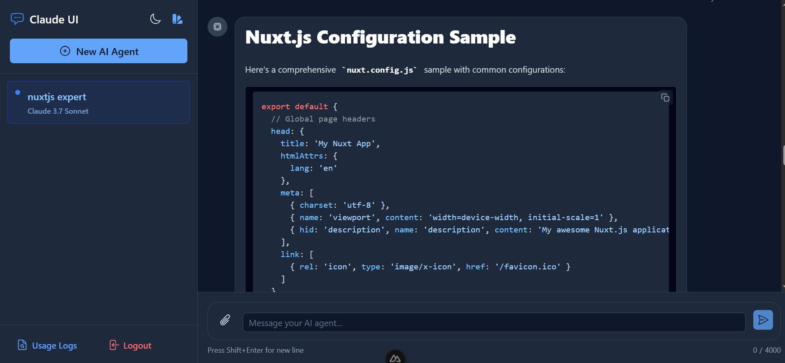

# Claude UI

A modern chat interface for Anthropic's Claude AI models built with Nuxt.js. Experience seamless conversations with Claude in a clean user interface.

## Prerequisites

- Node.js (v18 or higher)
- npm or yarn
- Anthropic API key

<p align="center">
  
</p>

## 🌟 Features

- 💾 Conversation history management
- 🎭 Multiple Claude model support
- 📝 Markdown and code syntax highlighting
- 🌙 Dark/Light mode toggle
- 🤖 Personlize behavior using system prompts for each chat
- 🎯 Limit output tokens for each chat
- 🔄 Custome temperature (Randomness) for each chat
- 📎💾 Prompt Caching for attachments
- 📝🔍 Text extraction and parsing

## Tech Stack

- 🚀 Built with [Nuxt 3](https://nuxt.com/)
- 💾 Database integration with [Drizzle ORM](https://orm.drizzle.team/)
- 🎨 UI components from [@nuxt/ui](https://ui.nuxt.com/)
- 🤖 AI integration with [@anthropic-ai/sdk](https://www.anthropic.com/)
- 📝 Advanced text extraction using Claude API for PDFs, images, and documents
- ✨ Markdown support with [markdown-it](https://github.com/markdown-it/markdown-it)
- 🎯 Code highlighting with [highlight.js](https://highlightjs.org/)

## Setup

Make sure to install the dependencies:

```bash
# npm
npm install

# pnpm
pnpm install

# yarn
yarn install
```

## Environment Configuration

Create a `.env` file in the root directory and add your Anthropic API key:

```bash
# Required: Get your API key from https://console.anthropic.com/
ANTHROPIC_KEY=your_anthropic_api_key_here

# Optional: Custom database path (defaults to ./database.db)
DATABASE_URL=./database.db
```

**To get your Anthropic API key:**

1. Visit [https://console.anthropic.com/](https://console.anthropic.com/)
2. Sign up or log in to your account
3. Navigate to API Keys section
4. Create a new API key
5. Copy the key and paste it in your `.env` file

## File Processing

The application now uses Claude API for advanced text extraction from various file types including:
- PDFs, Word documents, Excel sheets, PowerPoint presentations  
- Images (PNG, JPEG, GIF, WebP, BMP, TIFF) with OCR capabilities
- Plain text files (TXT, Markdown, JSON, etc.)

No additional system dependencies are required - everything is handled through the Claude API.

## ENV

Create a .env file in the root directory and add your `ANTHROPIC_KEY` API key as shown above in the Setup section.

## Development Server

Start the development server on http://localhost:3000:

```bash
# npm
npm run dev

# pnpm
pnpm dev

# yarn
yarn dev
```

## Production

Build the application for production:

```bash
# npm
npm run build

# pnpm
pnpm build

# yarn
yarn build
```

## Database

The application uses a SQLite database to store thread and message data.

### Database Management

This project uses Drizzle ORM for database management. Available commands:

```bash
# Generate database schema
npm run db:generate

# Migrate database schema
npm run db:migrate
```

## Todo

- [x] Add streaming support for long-running chats
- [ ] Add server-side validation for form inputs
- [x] Add user authentication
